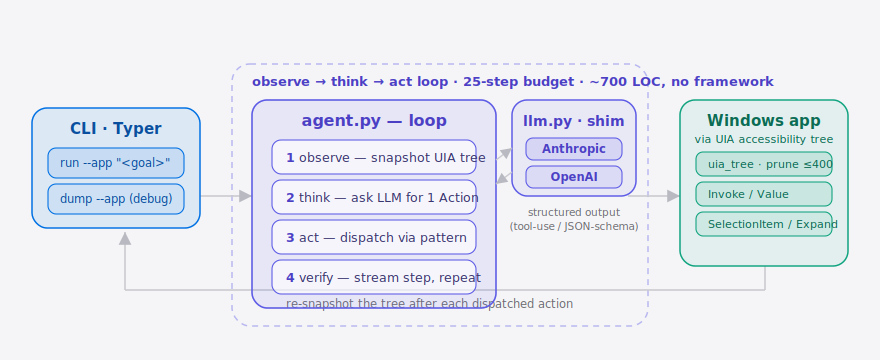

[English](./README.en.md) **·** [简体中文](./README.md)

<p align="center">
  
</p>

<p align="center">
  <a href="./LICENSE"></a>
  <a href="https://github.com/supermario-leo/uia-agent/releases"></a>
  
  
  <a href="https://github.com/supermario-leo/uia-agent/actions"></a>
  
</p>

> **uia-agent 是一个开源 LLM agent 框架，用 UIA 无障碍树驱动 Windows 老古董桌面软件。**
> 浏览器场景有 [browser-use](https://github.com/browser-use/browser-harness)，
> 桌面场景这块一直没人认真做。这就是这块。

## 为什么这个东西现在才出现

国内做政企、医疗、制造业开发的同行心里都清楚：

- 2008 年的 WinForms ERP、SAP GUI 客户端、SCADA 控制台、各种"绝对不能换"的 in-house 桌面软件，至今还在被人**手动**点鼠标驱动。
- 这些软件**没有 API**、**没有 SDK**、**没有官方自动化通道**。UiPath 这种 RPA 工具能用，但写脚本的成本几乎和招实习生手动操作差不多。
- 现在 Claude 4.x / GPT-5 这一代模型，多步工具调用的稳定性终于够了；`pywinauto` 和 `uiautomation` 这两个 Python 绑定也在最近 18 个月内追上了 .NET 版本的能力。

把这三个时间窗一对齐，结论很自然：**把 UIA 无障碍树当成 LLM agent 的 action space**，让模型每一步只输出一个结构化的 `Action`，由代码确定性地分发回 UIA。和 browser-use 同一个套路，只是把"DOM"换成了"UIA 树"。

## 目录

- [架构](#架构)
- [快速上手](#快速上手)
- [演示](#演示)
- [它实际做了什么](#它实际做了什么)
- [和现有方案对比](#和现有方案对比)
- [配置](#配置)
- [进阶用法](#进阶用法)
- [路线图](#路线图)
- [Benchmark 成绩单](./BENCHMARK.md)
- [诚实的局限](#诚实的局限)
- [相关项目](#相关项目)
- [许可证 + 贡献](#许可证--贡献)

##  架构

<p align="center">
  <picture>
    <source media="(prefers-color-scheme: dark)" srcset="./assets/atlas-dark.svg">
    <source media="(prefers-color-scheme: light)" srcset="./assets/atlas-light.svg">
    
  </picture>
</p>

自然语言目标进入 **Typer CLI**（`run`），CLI 启动 **agent 循环**：① *observe* — 快照当前焦点窗口的 UIA 树并剪枝到 ≤400 节点；② *think* — 把序列化后的树交给 **LLM 适配层**（Anthropic tool-use 或 OpenAI JSON-schema），拿回恰好一个结构化 `Action`；③ *act* — 通过真实 UIA 控件模式（Invoke / Value / SelectionItem / ExpandCollapse）把动作分发回正在运行的 **Windows 软件**；④ *verify* — 流式打出这一步并重新快照。没有服务、没有 daemon、没有 IPC——一个进程跑完，约 700 行 Python。

## 快速上手

> 前置：Windows 10/11 交互式桌面会话；`ANTHROPIC_API_KEY` 或 `OPENAI_API_KEY` 至少有一个。

```bash
pip install uia-agent
export ANTHROPIC_API_KEY=sk-ant-...        # 或者 OPENAI_API_KEY=sk-...
uia-agent run --app Notepad "输入 'hello world'，存到桌面，文件名 hello.txt"
```

完事。agent 会一行一行打出每一步：它选了什么动作、目标节点是哪个、为什么——直到它输出 `done` 或者用完 step 预算为止。

<details>
<summary>典型输出</summary>

```
step 01  click   → ee4f3c2a1d80  ✓ clicked Edit:'Document'
            why: 先把焦点放到编辑区再输入
step 02  type    → ee4f3c2a1d80  text='hello world'  ✓ typed into Edit:'Document'
            why: 把用户要的内容写进编辑区
step 03  key    text='^s'  ✓ sent keys '^s'
            why: 用快捷键调出"另存为"对话框
step 04  type    → a182be09f5cc  text='hello.txt'  ✓ typed into Edit:'文件名:'
            why: 按要求填写文件名
step 05  click   → 5b1c44e0aa10  ✓ clicked Button:'保存'
            why: 提交保存
step 06  done                                  ✓ agent reported done
            why: 文件已经落盘
```

</details>

##  演示

一句话进去，agent 先 dump 出 Notepad 剪枝后的 UIA 树，再端到端驱动它——聚焦编辑区、输入、调出"另存为"对话框、填文件名、点保存——全程一行一行流式打出每一步。

<p align="center">
  
</p>

## 它实际做了什么

整个项目不到 700 行 Python，承重的就三个文件：

| 文件 | 职责 |
|---|---|
| [`src/uia_agent/uia_tree.py`](./src/uia_agent/uia_tree.py) | 抓取当前焦点窗口的 UIA 树，剪枝到 ≤400 节点 / ≤12 层深；丢掉离屏 + 无名噪声叶子；给每个节点算一个稳定的 hash id。 |
| [`src/uia_agent/actions.py`](./src/uia_agent/actions.py) | 7 种有类型的动作（`click` / `type` / `select` / `expand` / `key` / `wait` / `done`），全部走真实 UIA pattern：Invoke、Value、SelectionItem、ExpandCollapse。 |
| [`src/uia_agent/agent.py`](./src/uia_agent/agent.py) | observe → think → act 循环。一个 `while`，不引入任何 framework，默认 25 步预算。 |

新意不在数据结构本身，而在框架：**把 UIA 树看成 LLM agent 的一类 action space**——和 DOM（browser-use）、像素（VLM）、人写的 selector（UiPath）并列。可防御的手艺是剪枝规则：怎么在真实老软件上把序列化后的树压到 8k token 以内，同时保留住所有可点的节点。

## 和现有方案对比

每一行都是真比过的，**不是营销话术**：

| | uia-agent | [browser-use](https://github.com/browser-use/browser-harness) | UiPath / Power Automate | VLM 截屏 agent |
|---|---|---|---|---|
| 行动空间 | **Windows UIA 树** | DOM | 人写的 selector 脚本 | 原始像素 |
| 每步成本 | UIA 遍历 + ~3-6k token | DOM 遍历 + 类似量级 | 0（预编译） | ~50× 倍 token（图像输入） |
| 确定性 | Pattern 分发（Invoke / Value / ...） | DOM event | 高，但 UI 一改就脆 | 低，模型依赖 |
| 不用人写 selector | ✓ | ✓ | ✗ | ✓ |
| 跨平台 | ✗（故意只做 Windows） | ✓（任何浏览器） | 部分 | ✓ |
| OSS + 自带模型 | ✓ MIT | ✓ MIT | ✗ | 因模型而异 |

老实说：browser-use 在跨平台和受众规模上明显赢。uia-agent 赢在那些**真实存在却没人愿意做**的场景——国企/医疗/制造业老 Windows 软件。这是我们故意挑的楔子。

## 配置

没有配置文件，三个环境变量管全部：

| 变量 | 类型 | 默认值 | 含义 |
|---|---|---|---|
| `ANTHROPIC_API_KEY` | string | 未设 | 设了就用 Anthropic。 |
| `OPENAI_API_KEY` | string | 未设 | 设了就用 OpenAI 作为备选。 |
| `UIA_AGENT_PROVIDER` | `anthropic` \| `openai` | 自动 | 两个 key 都有时强制选其一。 |
| `UIA_AGENT_MODEL` | string | 各 provider 默认 | 钉死一个具体模型 id（如 `claude-sonnet-4-6`、`gpt-4o-2024-11-20`）。 |

CLI 只有两个子命令：

```bash
uia-agent dump --app Notepad --indent 0
uia-agent run  --app Calculator --max-steps 15 "算一下 17 * 23"
```

##  进阶用法

**视觉兜底（v0.2）。** 老软件经常自己画控件，UIA 树里一个可点的节点都没有。加 `--vision`，当某一步剪枝后的 UIA 树拿不到任何可操作节点时，agent 会截屏 + OCR，按坐标点击置信度最高的文字区域，而不是直接放弃。UIA 优先的快路径不受影响——只要树里还有可点节点，就永远不会走到视觉这条路。需要 OCR 依赖：

```bash
pip install "uia-agent[vision]"          # 装 pytesseract + pillow（系统还需有 Tesseract）
uia-agent run --app LegacyERP --vision "在主面板点登录"
```

**框架适配层（v0.2）。** 把 `dump` / `run` 包成现成 agent 框架的 tool。先支持 LangChain，AutoGen / CrewAI 共用同一套 `UiaToolSpec` 形状。核心包保持零依赖，适配层是可选 extras：

```bash
pip install "uia-agent[langchain]"
```

```python
from uia_agent.adapters.langchain_tool import UiaDumpTool, UiaRunTool

tools = [UiaDumpTool(), UiaRunTool()]   # 直接喂给任意 LangChain agent
```

更多示例见 [`examples/`](./examples)。

## 路线图

- [x] **m1** — `uia-agent dump` 把任意 Windows 焦点窗口的 UIA 树剪枝后打成 JSON。
- [x] **m2** — `uia-agent run` 跑完 observe → think → act 循环，7 种动作 + 结构化 LLM 输出。
- [x] **m3** — 自带 Notepad / Calculator demo，README 录屏脚本（vhs），benchmark 脚手架。
- [x] **v0.2 — 框架适配层** — LangChain 接入（`uia-agent[langchain]`），AutoGen / CrewAI 共用同一套 tool 形状。
- [x] **v0.2 — 视觉兜底** — UIA 拿不到有效节点时退到 OCR + bbox 点击（`--vision`，`uia-agent[vision]`）。
- [x] **v0.2 — `BENCHMARK.md` 活的成绩单** — 按 (app × LLM × 版本) 维度公开真实 hit-rate，每次发版刷新。详见 [BENCHMARK.md](./BENCHMARK.md)。
- [ ] **v0.3 — 多窗口** — 跨两个焦点应用编排（比如 SAP GUI ↔ Excel）。
- [ ] **v0.3 — MCP server** — 把这套 action space 暴露成 MCP，让任意 MCP 客户端直接驱动桌面软件。

## 诚实的局限

- **只支持 Windows。** macOS 的 Accessibility API、Linux 的 AT-SPI 是完全不同的形状，v0.1 不承诺移植。
- **只支持有人值守的桌面。** UIA 需要交互式 session，v0.1 不跑无人值守 / 服务器场景。
- **唯一值得信任的指标是 hit-rate。** 如果你目标软件的 UIA 树本身就坏（节点没名字、没 Invoke、没 Value），UIA 这条路救不了你——这正是 `--vision` OCR 兜底要补的场景。[BENCHMARK.md](./BENCHMARK.md) 公开了 5 个参考应用按 (app × LLM × 版本) 维度的真实 hit-rate（v0.2.0 均值 83%）；如果哪天均值跌破 40%，我们会自己宣布 kill 项目而不是粉饰。
- **API key 自带。** 没有云端 runner、没有 telemetry、没有付费层。v0.1 就是 MIT + BYO。

## 相关项目

- [browser-use/browser-harness](https://github.com/browser-use/browser-harness) — 同样的 LLM-驱动 UI 树的范式，只不过 target 是 DOM。uia-agent 是它的桌面补集。
- [HKUDS/nanobot](https://github.com/HKUDS/nanobot) — agentic action-space 方向比较新的研究工作；他们在 DOM 类目标上的抽象，搬到 UIA 上是吻合的。
- [pywinauto](https://github.com/pywinauto/pywinauto) / [uiautomation](https://github.com/yinkaisheng/Python-UIAutomation-for-Windows) — 让这个 700 行的小项目能跑起来的真正功臣，所有 Windows 交互的脏活累活都是它们扛的。

## 许可证 + 贡献

MIT，详见 [LICENSE](./LICENSE)。欢迎 PR；超过单屏改动的修改建议先开 issue 对一下范围。

推到 GitHub 之后顺手设一下 topic，让发现路径正常：

```bash
gh repo edit --add-topic agent --add-topic windows --add-topic uia \
              --add-topic llm --add-topic accessibility
```

---

<p align="center"><sub><a href="./LICENSE">MIT</a> © 2026 SuperMarioYL</sub></p>
