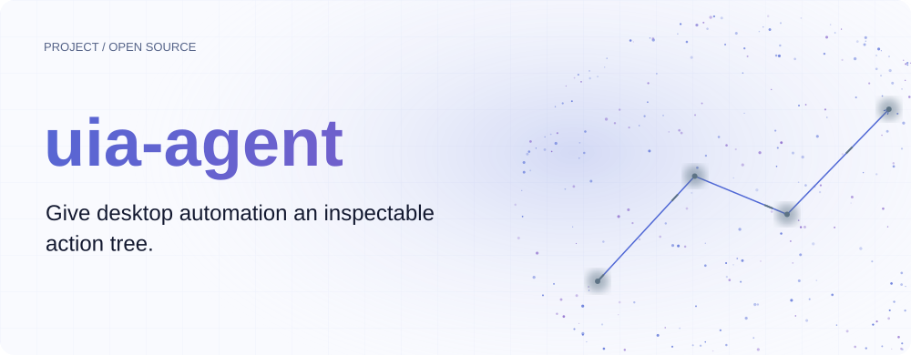
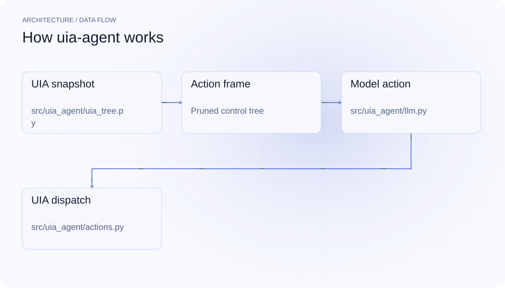
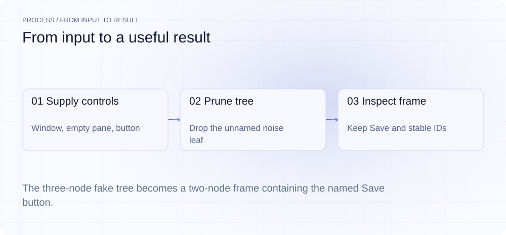
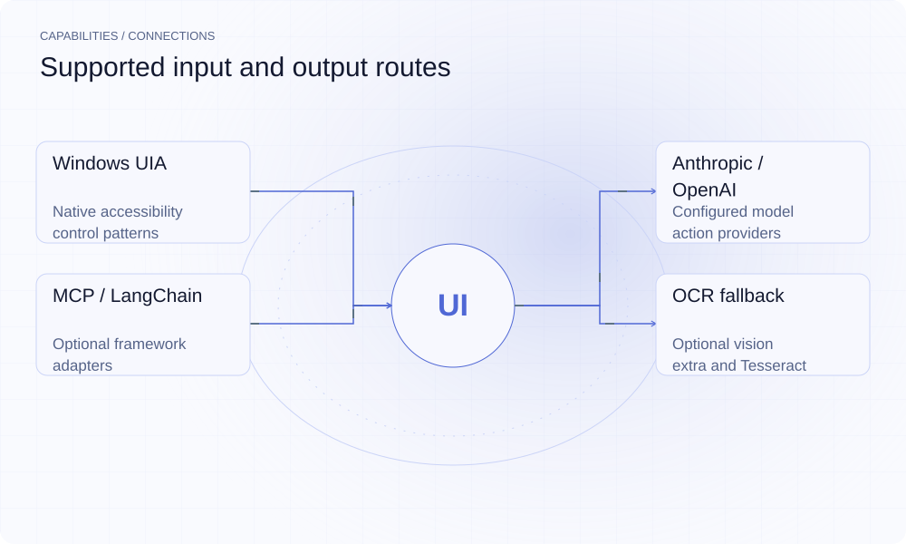

[English](./README.en.md) · [Website](https://uia-agent.lei6393.com) · [GitHub](https://github.com/SuperMarioYL/uia-agent)

<picture>
  <source media="(max-width: 600px) and (prefers-color-scheme: dark)" srcset="./assets/presentation/hero-mobile-dark.svg">
  <source media="(max-width: 600px)" srcset="./assets/presentation/hero-mobile-light.svg">
  <source media="(prefers-color-scheme: dark)" srcset="./assets/presentation/hero-dark.svg">
  
</picture>

# uia-agent

**让桌面自动化使用可检查的动作树。**

uia-agent 快照 Windows 无障碍树，将其裁剪为紧凑动作帧，并通过支持的 UIA pattern 分发类型化动作。

## 为什么需要它

旧桌面应用即使没有业务 API，也可能暴露无障碍控件。带名称的控件树为模型选择下一步操作提供结构化依据。

- **结构化控件上下文** — 名称、值和支持的 pattern 保持可见。
- **有界快照** — 深度和节点预算限制遍历树。
- **类型化动作分发** — 动作通过统一分发器调用 UIA pattern。

## 架构

<picture>
  <source media="(max-width: 600px) and (prefers-color-scheme: dark)" srcset="./assets/presentation/architecture-mobile-dark.svg">
  <source media="(max-width: 600px)" srcset="./assets/presentation/architecture-mobile-light.svg">
  <source media="(prefers-color-scheme: dark)" srcset="./assets/presentation/architecture-dark.svg">
  
</picture>

uia_tree 在深度和节点预算内遍历控件并分配稳定 ID。模型适配器返回一个 Action，actions 通过控件 pattern 分发。Agent 在步数预算内重复观察与操作，可选适配器将流程暴露给 MCP 或 LangChain。

| 组件 | 职责 |
| --- | --- |
| `UIA snapshot` | src/uia_agent/uia_tree.py |
| `Action frame` | Pruned control tree |
| `Model action` | src/uia_agent/llm.py |
| `UIA dispatch` | src/uia_agent/actions.py |

## 安装与快速上手

使用仓库清单指定的运行时版本构建，并在仓库根目录运行示例。

```bash
git clone https://github.com/SuperMarioYL/uia-agent.git
cd uia-agent
uv venv .venv
uv pip install --python .venv/bin/python pydantic
uv pip install --python .venv/bin/python --no-deps -e .
```

可移植示例向生产快照遍历器提供三个假控件，检查最终保留的两个节点。

```bash
.venv/bin/python examples/presentation-demo.py
```

## 实际运行示例

<picture>
  <source media="(max-width: 600px) and (prefers-color-scheme: dark)" srcset="./assets/presentation/process-mobile-dark.svg">
  <source media="(max-width: 600px)" srcset="./assets/presentation/process-mobile-light.svg">
  <source media="(prefers-color-scheme: dark)" srcset="./assets/presentation/process-dark.svg">
  
</picture>

The three-node fake tree becomes a two-node frame containing the named Save button.

```text
input nodes: 3
retained nodes: 2
retained: Button Save ['Invoke']
stable snapshot IDs: True
```

完整命令与输出保存在 [docs/demo-results.json](./docs/demo-results.json). 输入和复现代码均随仓提供。


保留已有录制供参考；上方文字示例给出当前可复现的操作。

## 用法

CLI 提供以下操作。示例之外的命令需要替换成你的文件路径或标识。

```bash
# On Windows, in a fully installed environment:
uia-agent dump --app Notepad --indent 0
uia-agent run --app Calculator --max-steps 15 "Compute 17 * 23"
```

## 配置

可移植树示例仅需 pydantic 与源码包，因此下方安装明确使用 --no-deps。实际 Windows 自动化应在 Windows 环境执行 python -m pip install -e . 安装完整依赖。ANTHROPIC_API_KEY 或 OPENAI_API_KEY 提供凭据，UIA_AGENT_PROVIDER 与 UIA_AGENT_MODEL 选择提供方/模型。Windows 虚拟环境解释器路径为 .venv\Scripts\python.exe。

## 集成与职责分工

<picture>
  <source media="(max-width: 600px) and (prefers-color-scheme: dark)" srcset="./assets/presentation/integrations-mobile-dark.svg">
  <source media="(max-width: 600px)" srcset="./assets/presentation/integrations-mobile-light.svg">
  <source media="(prefers-color-scheme: dark)" srcset="./assets/presentation/integrations-dark.svg">
  
</picture>

以下路径已有源码实现。按任务选择输入，并把生成的结果与项目一起保存。

| 路径 | 已实现职责 |
| --- | --- |
| Windows UIA | Native accessibility control patterns |
| Anthropic / OpenAI | Configured model action providers |
| MCP / LangChain | Optional framework adapters |
| OCR fallback | Optional vision extra and Tesseract |

## 限制与后续方向

- 原生自动化需要交互式 Windows 桌面，以及具有可用 UIA 控件的应用。离线示例无法验证该环境。
- 演示使用假控件树，只测试裁剪，不点击、输入、调用模型或自动操作实际应用。
- 模型驱动操作可能改变应用数据。模型报告 done 不等于目标已被独立验证完成。

更广应用覆盖需要真实 Windows fixture 与结果验证；OCR 和框架适配器有额外依赖，也需独立验收。

## 许可与贡献

许可见 [LICENSE](./LICENSE). 反馈问题时请提供最小输入、执行命令和实际输出。
